# slidev-theme-troshab

## Minimal Universal Slidev Theme

**Complete Feature Showcase** · 2024

---
layout: default
---

# Agenda

1. **Layouts** — All 20 layout types (including new split layouts)
2. **Column Ratios** — is-3 to is-9 demonstrations
3. **Components** — Steps, Tags
4. **Data & Visuals** — Mermaid, PlantUML, tables, code, KPIs
5. **Styling** — Colors, typography, buttons
6. **Accessibility** — Safe zone, focus, contrast
7. **Motion** — Transitions, animations
8. **Interactive** — v-click, v-mark, reveals
9. **LaTeX & Math** — Inline and block equations
10. **Code Features** — Monaco, Monaco Runner, TwoSlash, Magic Move
11. **Icons** — Iconify collections
12. **Motion Live Demo** — Transitions in action
13. **Reveal Styles** — Slide, pop animations
14. **Presenter** — Notes, drawing mode
15. **Configuration** — Frontmatter reference
16. **Callouts** — Note, Warning, Tip blocks
17. **Advanced** — Code Groups, Draggable, Transform, Global Layers
18. **Built-in Components** — Toc, Arrow, YouTube, VSwitch
19. **Advanced Code** — Line numbers, scrollable, imports
20. **Advanced Animation** — v-motion, v-drag, Transform
21. **Presenter & Recording** — Drawing, camera, zoom
22. **Navigation** — Click markers, hidden slides

---
layout: section
transition: fade
---

# Section 1

Layouts Overview

---
layout: center
---

# Simplicity is the ultimate sophistication

One powerful idea is better than ten weak ones

> **Features:** `center` layout, vertical/horizontal centering, no background

---
layout: two-cols
columns: is-6
---

# Code + Result

::left::

```typescript
function greet(name: string): string {
  return `Hello, ${name}!`;
}

console.log(greet('World'));
```

::right::

**Result:**

```
Hello, World!
```

**Explanation:**
- Function accepts a string
- Returns a greeting
- Outputs to console

> **Features:** `two-cols` layout, `::left::` `::right::` slots, `columns: is-6`

---
layout: side-title
side: left
titleWidth: is-4
---

::title::

# Side Title

Left variant with `titleWidth: is-4`

::default::

Content appears to the right of the colored title bar.

**Props:**
- `side: left | right`
- `titleWidth: is-3 | is-4`

Perfect for emphasizing section titles or creating visual hierarchy.

---
layout: side-title
side: right
titleWidth: is-3
---

::title::

# Side Right

Narrow 25% bar

::default::

This demonstrates the `side-title` layout with:
- `side: right` — title bar on the right
- `titleWidth: is-3` — 25% width (narrower)

Content appears on the left with more space. Good for emphasis when main content is on the left side.

---
layout: top-title
---

::title::

# Top Title Layout

::default::

A colored gradient bar at the top with the title.

Main content area below.

- Clean separation between title and content
- Maintains consistency with side-title
- Good for important announcements

---
layout: quote
author: Steve Jobs
source: Stanford Commencement, 2005
---

Stay hungry, stay foolish.

---
layout: fact
value: "73%"
label: "of developers consider presentations an important communication tool"
source: "Stack Overflow Survey 2024"
transition: fade
---

---
layout: intro
name: John Doe
title: Senior Software Engineer @ TechCorp
side: right
---

- 10+ years of web development experience
- Open source contributor (Vue, Vite)
- Conference speaker
- Technical blog author

> **Features:** `intro` layout, `name`/`title`/`side` props, avatar with initials

---
layout: intro
name: Jane Smith
title: Product Manager @ StartupCo
side: left
---

- 8 years in product development
- Led 3 successful product launches
- Former UX designer
- MBA from Stanford

---
layout: intro
image: https://images.unsplash.com/photo-1507003211169-0a1dd7228f2d?w=400&h=400&fit=crop
name: Alex Chen
title: Design Lead @ CreativeLab
side: right
---

- Award-winning visual designer
- Published in Design Weekly
- Teaches at Design Institute
- Passionate about accessibility

---
layout: image
image: https://images.unsplash.com/photo-1517694712202-14dd9538aa97?w=1200
caption: bottom
transition: fade
---

The modern developer's workspace — caption at the bottom

---
layout: image
image: https://images.unsplash.com/photo-1555066931-4365d14bab8c?w=1200
caption: overlay
transition: fade
---

Clean code example — caption as overlay on image

---
layout: iframe
src: https://sli.dev/
title: Slidev Demo
---

Official Slidev documentation (embedded iframe)

---
layout: full
---

<div class="h-full w-full flex items-center justify-center bg-gradient-to-br from-blue-600 to-purple-700">
  <div class="text-white text-center">
    <h1 class="text-6xl font-bold mb-4">Fullscreen Layout</h1>
    <p class="text-2xl opacity-80">Edge-to-edge, no safe-zone padding</p>
  </div>
</div>

---
layout: image-left
image: https://images.unsplash.com/photo-1517694712202-14dd9538aa97?w=800
---

# Image Left Layout

Content appears on the **right side** while the image fills the left half.

**Props:**
- `image` — path to image (required)
- `backgroundSize` — `cover` (default) or `contain`

**Use cases:**
- Feature introductions
- Product showcases
- Visual storytelling

---
layout: image-right
image: https://images.unsplash.com/photo-1555066931-4365d14bab8c?w=800
---

# Image Right Layout

Content appears on the **left side** while the image fills the right half.

**Use cases:**
- Explanations with visual context
- Before/after scenarios
- Code with screenshot

Perfect for pairing text-heavy content with supporting imagery.

---
layout: iframe-left
src: https://sli.dev/
title: Slidev Documentation
---

# Iframe Left Layout

The iframe appears on the left, with explanatory content on the right.

**Props:**
- `src` — URL to embed (required)
- `title` — accessibility title

**Use cases:**
- Live demos with annotations
- Documentation with explanation
- Video with talking points

---
layout: iframe-right
src: https://vuejs.org/
title: Vue.js Documentation
---

# Iframe Right Layout

Content on the left, iframe on the right.

**Use cases:**
- Introduction before demo
- Setup instructions with live preview
- Code explanation with result

The content area has safe-zone padding while the iframe goes edge-to-edge.

---
layout: two-cols-header
columns: is-6
---

::header::

# Two Columns with Header

This layout adds a header row above the two-column grid.

::left::

**Left Column**

- First point
- Second point
- Third point

::right::

**Right Column**

- Fourth point
- Fifth point
- Sixth point

---
layout: statement
---

# Make it simple.
# Make it memorable.
# Make it inviting to look at.

---
layout: end
transition: fade
---

# Questions?

Ready to answer

email@example.com · @twitter_handle

---
layout: two-cols
columns: is-3
---

# is-3 (25:75)

::left::

**Menu**

- Home
- About
- Contact

::right::

### Main Content Area

This layout is ideal for navigation sidebars with a narrow menu on the left and wide content area on the right.

Lorem ipsum dolor sit amet, consectetur adipiscing elit. Sed do eiusmod tempor incididunt ut labore.

---
layout: two-cols
columns: is-4
---

# is-4 (33:67)

::left::

**Sidebar**

Additional info:
- Item 1
- Item 2
- Item 3
- Item 4

::right::

### Article Content

One-third / two-thirds split. Good for supplementary information alongside main content.

This ratio provides enough space for meaningful sidebar content while keeping focus on the main area.

---
layout: two-cols
columns: is-5
---

# is-5 (42:58)

::left::

**Left Column**

Slightly narrower than half.

Useful when you want near-equal split but with subtle emphasis on the right side.

::right::

**Right Column**

This side gets a bit more space.

Perfect for code + explanation where explanation needs slightly more room.

---
layout: two-cols
columns: is-6
---

# is-6 (50:50)

::left::

**Left Half**

Equal split is the default.

Best for:
- Comparisons
- Before/After
- Pros/Cons

::right::

**Right Half**

Both columns have identical width.

Use when content is equally important on both sides.

---
layout: two-cols
columns: is-7
---

# is-7 (58:42)

::left::

**Primary Content**

Left side dominates with more space.

Use this when the left content is the main focus but you still need a substantial right column.

Good for main content + supporting details.

::right::

**Secondary**

Supporting information goes here.

- Note 1
- Note 2

---
layout: two-cols
columns: is-8
---

# is-8 (67:33)

::left::

**Main Content Area**

Two-thirds / one-third is great for:

- Code blocks with small explanation
- Images with metadata
- Articles with sidebar notes

The left column has significant space for detailed content while the right provides context.

::right::

**Notes**

Key points:
1. First
2. Second
3. Third

---
layout: two-cols
columns: is-9
---

# is-9 (75:25)

::left::

**Wide Content**

Three-quarters width for the main content. Use when you need maximum space on one side with minimal supporting content.

Perfect for:
- Large diagrams with labels
- Wide tables with legend
- Full-width code with line numbers

Lorem ipsum dolor sit amet, consectetur adipiscing elit. Nullam euismod, nisl eget aliquam ultricies.

::right::

**Mini**

Narrow column for:
- Icons
- Status
- Quick ref

---
layout: two-cols
columns: is-6
align: bottom
---

# align: bottom

::left::

**Short Left**

This column has less content but aligns to the bottom of the slide.

::right::

**Longer Right**

This column has more content.

The `align: bottom` prop aligns both columns to the bottom edge.

Useful when:
- Content lengths vary significantly
- You want visual grounding
- Building comparison slides with unequal content

The shorter column floats down to match.

---
layout: default
---

# Steps Component (Static)

<Steps :items="['Analysis', 'Design', 'Development', 'Testing', 'Deploy']" :current="3" />

### Current stage: Development

| Stage | Status | Progress |
|-------|--------|----------|
| Analysis | Done | 100% |
| Design | Done | 100% |
| Development | In progress | 60% |
| Testing | Waiting | 0% |
| Deploy | Waiting | 0% |

---
layout: default
clicks: 3
---

# Steps Component (Clicks Mode)

Click to advance through the steps:

<Steps :items="['Plan', 'Build', 'Test', 'Ship']" mode="clicks">
  <template #step1>
    <h3>1. Planning Phase</h3>
    <ul>
      <li>Define project requirements</li>
      <li>Create timeline and milestones</li>
      <li>Assign team responsibilities</li>
    </ul>
  </template>
  <template #step2>
    <h3>2. Building Phase</h3>
    <pre><code class="language-ts">function build() {
  const app = createApp()
  app.configure()
  return app.compile()
}</code></pre>
  </template>
  <template #step3>
    <h3>3. Testing Phase</h3>
    <ul>
      <li>Unit tests: <strong>142 passed</strong></li>
      <li>Integration tests: <strong>28 passed</strong></li>
      <li>E2E tests: <strong>12 passed</strong></li>
    </ul>
  </template>
  <template #step4>
    <h3>4. Ship It!</h3>
    <p>Ready for production deployment.</p>
  </template>
</Steps>

---
layout: default
---

# Tags Component

<Tags :items="['Vue.js', 'TypeScript', 'Slidev', 'Vite', 'UnoCSS']" />

### Use cases:
- Tag clouds for topics
- Technology stacks
- Skills listing
- Category labels

---
layout: default
---

# Mermaid: Flowchart

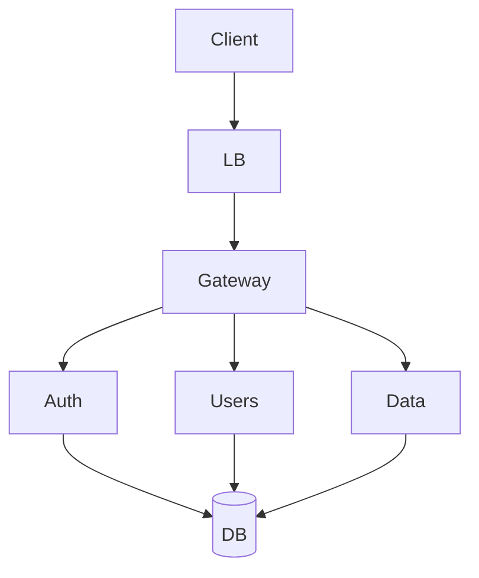

**Directions:** `TD` (top-down), `LR` (left-right), `BT`, `RL`

---
layout: default
---

# Mermaid: XY Chart

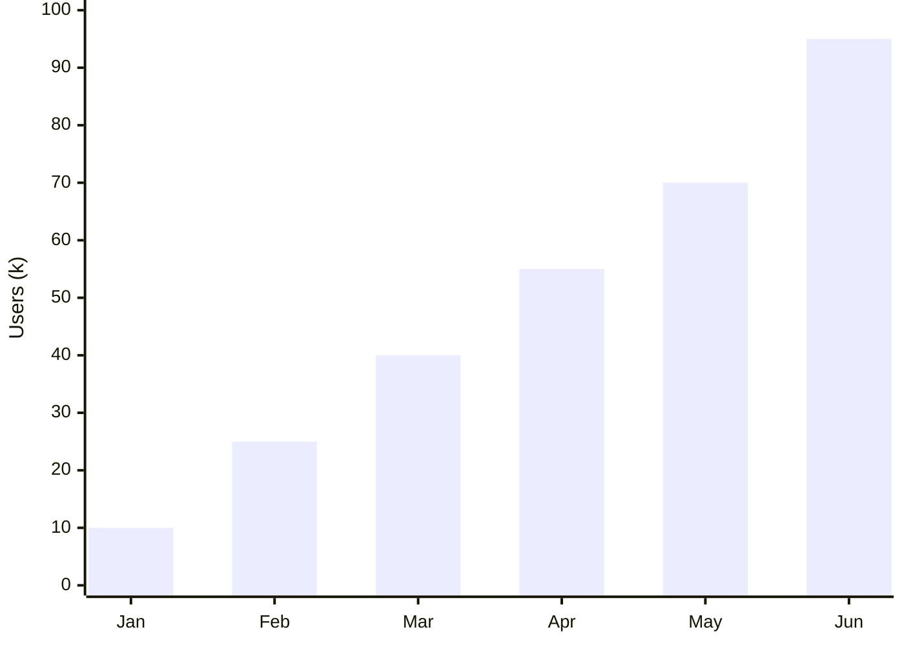

**+850%** growth in six months

---
layout: default
---

# Mermaid: Pie Chart

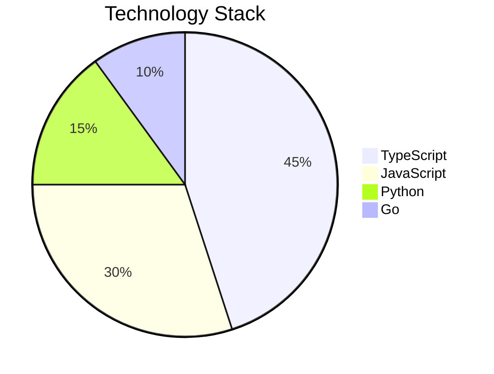

**Best practices:** Max 5 segments, short labels (max 12 chars)

---
layout: default
---

# Mermaid: Sequence Diagram

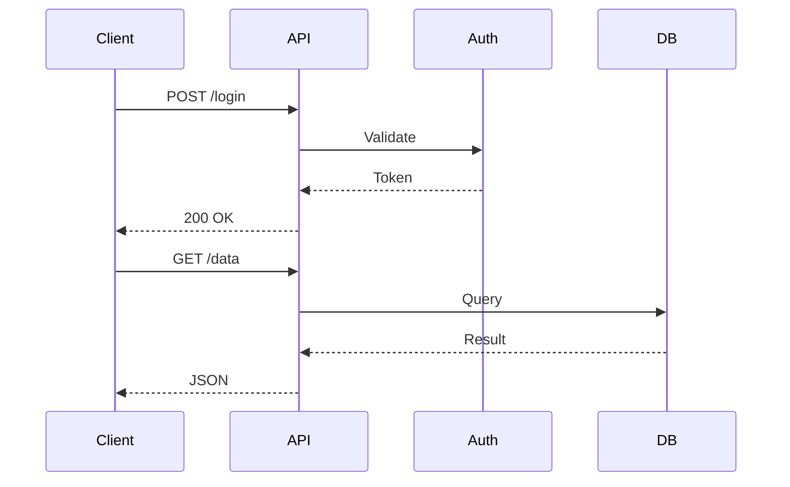

**Tips:** Max 4 participants, short names (2-6 chars)

---
layout: default
---

# Mermaid: Class Diagram

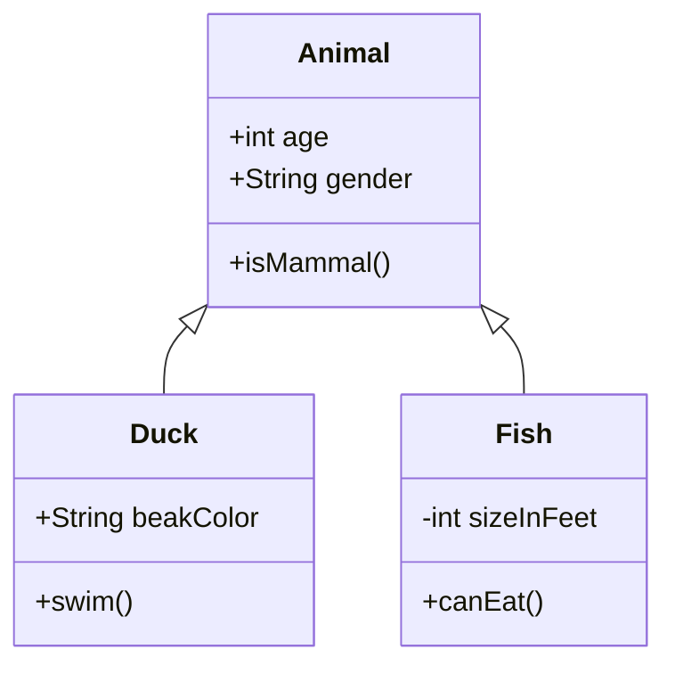

---
layout: default
---

# Mermaid: State Diagram

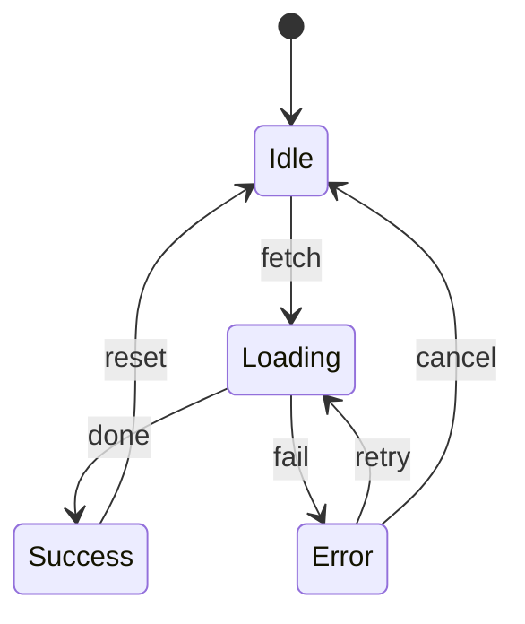

---
layout: default
---

# Mermaid: ER Diagram

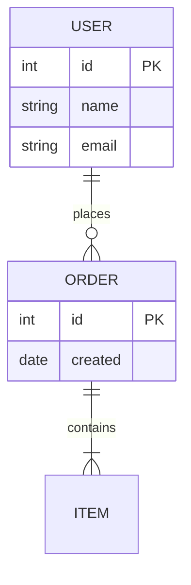

---
layout: default
---

# Mermaid: Gantt Chart

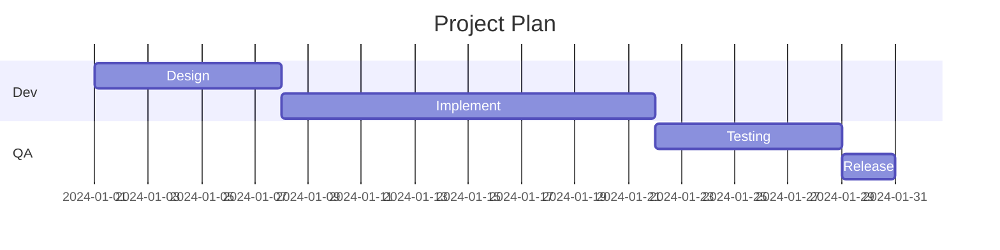

---
layout: default
---

# Mermaid: Timeline

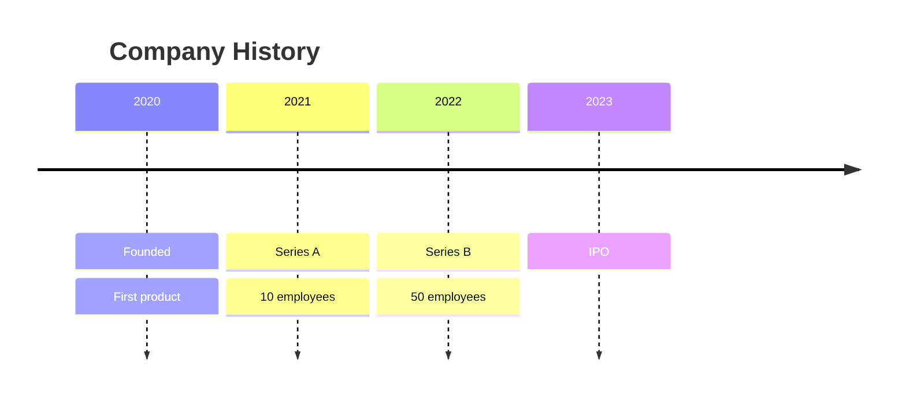

---
layout: default
---

# Mermaid: Mindmap

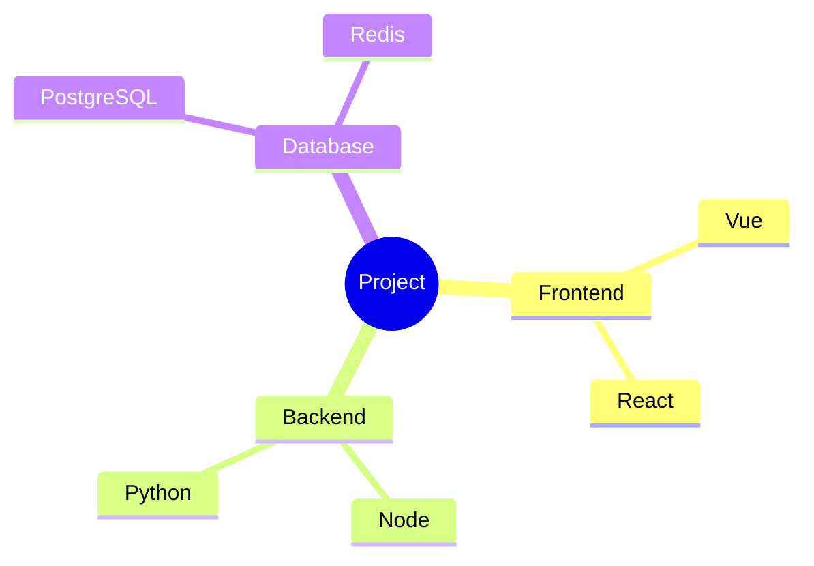

---
layout: default
---

# Mermaid: Git Graph

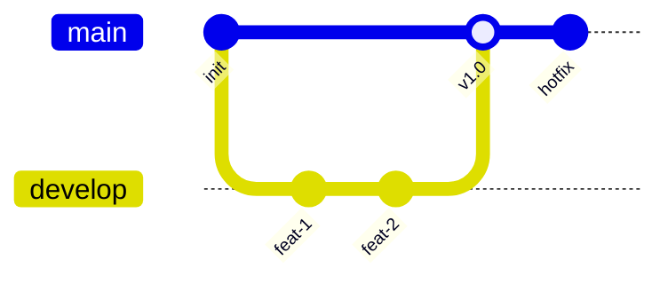

> **Features:** Mermaid `gitGraph`, branch visualization, commit history

---
layout: default
---

# PlantUML: Sequence Diagram

PlantUML renders on external server. Use our theme from GitHub:

```plantuml
@startuml
!theme troshab-dark from https://raw.githubusercontent.com/troshab/slidev-theme-troshab/master/themes

Alice -> Bob: Hello Bob!
Bob --> Alice: Hi Alice!
Alice -> Bob: Request data
Bob --> Alice: Return data
@enduml
```

> **Usage:** `!theme troshab-dark from https://raw.githubusercontent.com/.../themes`

---
layout: default
---

# PlantUML: Use Case Diagram

```plantuml
@startuml
!theme troshab-dark from https://raw.githubusercontent.com/troshab/slidev-theme-troshab/master/themes

left to right direction
actor User
actor Admin
rectangle System {
  User --> (Login)
  User --> (View Data)
  Admin --> (Manage Users)
  Admin --> (View Reports)
}
@enduml
```

> **Light theme:** replace `troshab-dark` with `troshab-light`

---
layout: default
---

# Tables

| Framework | Bundle | Performance | Learning | Ecosystem |
|-----------|--------|-------------|----------|-----------|
| React | ~42kb | 4/5 | Medium | Huge |
| Vue | ~33kb | 4/5 | Easy | Large |
| Svelte | ~1.6kb | 5/5 | Easy | Growing |
| Solid | ~7kb | 5/5 | Medium | Growing |

---
layout: default
---

# Code Blocks

```typescript
interface User {
  id: string;
  name: string;
  email: string;
  role: 'admin' | 'user' | 'editor';
}

async function fetchUsers(): Promise<User[]> {
  const response = await fetch('/api/users');
  if (!response.ok) throw new Error('HTTP error');
  return response.json();
}
```

**Best practices:** Max 12-15 lines, 80 chars width for full-width slides.

---
layout: default
---

# KPI Tiles

<div class="grid grid-cols-4 gap-4 mt-8">
  <div class="text-center p-6 bg-blue-100 dark:bg-blue-900/30 rounded-lg">
    <div class="text-4xl font-bold text-blue-600">99.9%</div>
    <div class="text-sm opacity-70 mt-2">Uptime</div>
  </div>
  <div class="text-center p-6 bg-green-100 dark:bg-green-900/30 rounded-lg">
    <div class="text-4xl font-bold text-green-600">< 50ms</div>
    <div class="text-sm opacity-70 mt-2">Latency</div>
  </div>
  <div class="text-center p-6 bg-purple-100 dark:bg-purple-900/30 rounded-lg">
    <div class="text-4xl font-bold text-purple-600">1M+</div>
    <div class="text-sm opacity-70 mt-2">Users</div>
  </div>
  <div class="text-center p-6 bg-orange-100 dark:bg-orange-900/30 rounded-lg">
    <div class="text-4xl font-bold text-orange-600">4.9/5</div>
    <div class="text-sm opacity-70 mt-2">Rating</div>
  </div>
</div>

---
layout: default
---

# Team Grid

<div class="grid grid-cols-4 gap-6 mt-8">
  <div class="text-center">
    <div class="w-24 h-24 mx-auto rounded-full bg-gradient-to-br from-blue-400 to-blue-600 flex items-center justify-center text-white text-3xl font-bold">JD</div>
    <div class="mt-3 font-semibold">John Doe</div>
    <div class="text-sm opacity-70">Tech Lead</div>
  </div>
  <div class="text-center">
    <div class="w-24 h-24 mx-auto rounded-full bg-gradient-to-br from-green-400 to-green-600 flex items-center justify-center text-white text-3xl font-bold">JS</div>
    <div class="mt-3 font-semibold">Jane Smith</div>
    <div class="text-sm opacity-70">Backend Dev</div>
  </div>
  <div class="text-center">
    <div class="w-24 h-24 mx-auto rounded-full bg-gradient-to-br from-purple-400 to-purple-600 flex items-center justify-center text-white text-3xl font-bold">AJ</div>
    <div class="mt-3 font-semibold">Alex Johnson</div>
    <div class="text-sm opacity-70">Frontend Dev</div>
  </div>
  <div class="text-center">
    <div class="w-24 h-24 mx-auto rounded-full bg-gradient-to-br from-orange-400 to-orange-600 flex items-center justify-center text-white text-3xl font-bold">MK</div>
    <div class="mt-3 font-semibold">Maria Kim</div>
    <div class="text-sm opacity-70">Designer</div>
  </div>
</div>

---
layout: default
---

# Button Styles

<div class="flex flex-wrap gap-4 mt-6">
  <button class="btn btn-primary">Primary</button>
  <button class="btn btn-success">Success</button>
  <button class="btn btn-danger">Danger</button>
  <button class="btn btn-secondary">Secondary</button>
</div>

<div class="flex flex-wrap gap-4 mt-6">
  <a href="#" class="btn btn-primary">Link Primary</a>
  <a href="#" class="btn btn-success">Link Success</a>
  <a href="#" class="btn btn-danger">Link Danger</a>
  <a href="#" class="btn btn-secondary">Link Secondary</a>
</div>

Links have underline (disappears on hover) for accessibility.

---
layout: default
---

# Color Palette

<div class="color-grid">
  <div class="color-swatch swatch-bg">
    <div class="swatch-label">--color-bg</div>
  </div>
  <div class="color-swatch swatch-bg-soft">
    <div class="swatch-label">--color-bg-soft</div>
  </div>
  <div class="color-swatch swatch-bg-muted">
    <div class="swatch-label">--color-bg-muted</div>
  </div>
  <div class="color-swatch swatch-primary">
    <div class="swatch-label">--color-primary</div>
  </div>
  <div class="color-swatch swatch-success">
    <div class="swatch-label">--color-success</div>
  </div>
  <div class="color-swatch swatch-warning">
    <div class="swatch-label">--color-warning</div>
  </div>
  <div class="color-swatch swatch-danger">
    <div class="swatch-label">--color-danger</div>
  </div>
  <div class="color-swatch swatch-info">
    <div class="swatch-label">--color-info</div>
  </div>
</div>

---
layout: default
---

# Typography

## Heading 2 (1.75rem)

### Heading 3 (1.375rem)

**Bold text** for emphasis. *Italic only for titles/terms.*

Regular body text at 1.25rem (20px) optimized for projectors.

- Line height: 1.5 (BDA, WCAG)
- Letter spacing: 0.02em
- Max width: 65ch (Baymard)

`Inline code` uses IBM Plex Mono.

---
layout: default
---

# Semantic Text Colors

<div class="flex flex-wrap gap-6 mt-6">
  <span class="text-primary">Primary (links)</span>
  <span class="text-success">Success</span>
  <span class="text-warning">Warning</span>
  <span class="text-danger">Danger/Error</span>
</div>

### Text hierarchy

<span>Primary text (--color-text) — 16:1 contrast</span>

<span class="text-secondary">Secondary text (--color-text-secondary) — 7.5:1</span>

<span class="text-tertiary">Tertiary text (--color-text-tertiary) — 4.8:1</span>

---
layout: default
---

# Column Ratios Reference

| Value | Left:Right | Use case |
|-------|------------|----------|
| `is-3` | 25% : 75% | Small sidebar, large content |
| `is-4` | 33% : 67% | Sidebar navigation |
| `is-5` | 42% : 58% | Slightly asymmetric |
| `is-6` | 50% : 50% | Equal split (default) |
| `is-7` | 58% : 42% | Emphasis on left |
| `is-8` | 67% : 33% | Large content, small aside |
| `is-9` | 75% : 25% | Very wide left column |

---
layout: default
---

# Safe Zone Test

Content has `--safe-inset-x: 5%` and `--safe-inset-y: 5%` padding to protect from cropping on projectors and TVs.

> **Tip:** Add class `debug-safe-zone` to the body element to see a red dashed border of the safe zone.

**Edge-to-edge layouts** (no safe zone): `full`, `image`, `iframe`

---
layout: default
---

# Focus Navigation Test

Press **Tab** to navigate between interactive elements:

<div class="flex gap-4 mt-6">
  <button class="btn btn-primary">Button 1</button>
  <button class="btn btn-success">Button 2</button>
  <a href="#" class="btn btn-secondary">Link Button</a>
</div>

> **WCAG 2.2 Compliant:** Focus ring is 3px solid var(--color-primary) with outline-offset: 2px

---
layout: default
---

# Contrast Compliance

| Element | Light | Dark | Requirement |
|---------|-------|------|-------------|
| text / bg | 16:1 | 13:1 | >= 7:1 (AAA) |
| text-secondary / bg | 7.5:1 | 6.5:1 | >= 4.5:1 (AA) |
| text-tertiary / bg | 4.8:1 | 4.6:1 | >= 4.5:1 (AA) |
| primary / bg | 4.7:1 | 10:1 | >= 4.5:1 (AA) |

**Accessibility features:**
- Off-white/off-black colors instead of pure white/black
- WCAG 2.2 focus styles

---
layout: default
---

# Long Content Test

## A very long title that spans multiple lines for testing text wrapping behavior

1. First item with detailed description
2. Second item
3. Third item
4. Fourth item
5. Fifth item
6. Sixth item
7. Seventh item

> **Note:** If content exceeds viewport, scroll should appear within the slide area.

---
layout: section
transition: fade
---

# Section 7

Motion System

---
layout: default
---

# Motion Modes

Theme supports 3 motion modes via class on slide/container:

| Mode | Class | Behavior |
|------|-------|----------|
| Calm | (default) | Subtle, 240ms duration |
| Crisp | `motion-crisp` | Fast, 150ms, small shifts |
| Expressive | `motion-expressive` | Slow, 400ms, dramatic |

```yaml
---
layout: default
class: motion-crisp
---
```

All modes use IBM Carbon easing functions for natural feel.

---
layout: default
---

# Slide Transitions

Available transitions via `transition:` frontmatter:

| Transition | Effect | Best for |
|------------|--------|----------|
| `slide-left` | Push left | Content slides (default) |
| `fade` | Crossfade | Accent slides (section, fact, end) |
| `slide-right` | Push right | Back navigation |
| `slide-up` | Rise from bottom | Special reveals |
| `slide-down` | Drop from top | Overlays |

```yaml
---
transition: fade
---
```

---
layout: default
class: reveal-fade
---

# v-click Reveal Styles

<v-click>

**Default:** Fade + subtle rise (standard Slidev)

</v-click>

<v-click>

**reveal-fade:** Opacity only (this slide uses it)

</v-click>

<v-click>

**reveal-slide:** Slide from right

</v-click>

<v-click>

**reveal-pop:** Scale up

</v-click>

Apply class to slide: `class: reveal-fade`

---
layout: section
transition: fade
---

# Section 8

Interactive Features

---
layout: default
---

# v-click Basics

Click to reveal elements step by step:

<v-click>

**Step 1:** First element appears

</v-click>

<v-click>

**Step 2:** Second element appears

</v-click>

<v-click>

**Step 3:** Third element appears

</v-click>

Use `<v-click>` to wrap content that should appear on click.

> **Features:** `<v-click>` component, click-based reveal, presenter notes

---
layout: default
---

# v-clicks for Lists

Use `<v-clicks>` to automatically wrap list items:

<v-clicks>

- First item appears
- Second item appears
- Third item appears
- Fourth item appears
- Fifth item appears

</v-clicks>

Much cleaner than wrapping each `<li>` individually!

> **Features:** `<v-clicks>` component, automatic list item wrapping

---
layout: default
---

# Click Sequencing

Control the order of appearance:

<v-click at="3">

**Third** (at="3")

</v-click>

<v-click at="1">

**First** (at="1")

</v-click>

<v-click at="2">

**Second** (at="2")

</v-click>

<v-click at="+1">

**Fourth** (at="+1" — relative to previous)

</v-click>

Use `at` prop to control sequence order.

> **Features:** `at` prop, click sequencing, relative positioning (`+1`)

---
layout: default
---

# Show and Hide

<v-click>

**Appears on click 1** — normal behavior

</v-click>

<v-click hide>

**Visible initially, hides on click 2**

</v-click>

<div v-click="[2, 4]">

**Visible only during clicks 2-3** (range syntax)

</div>

<v-after>

**v-after:** Appears with the previous element

</v-after>

---
layout: default
---

# v-mark Highlighting

Use `v-mark` to highlight text with rough notation:

<v-click>

This is <v-mark>highlighted text</v-mark> using default style.

</v-click>

<v-click>

This is <v-mark type="underline" color="red">underlined</v-mark> in red.

</v-click>

<v-click>

This is <v-mark type="circle" color="green">circled</v-mark> in green.

</v-click>

<v-click>

This is <v-mark type="box" color="blue">boxed</v-mark> in blue.

</v-click>

Powered by Rough Notation library.

> **Features:** `v-mark` directive, types: underline/circle/box, custom colors

---
layout: default
---

# Progressive Highlighting

<v-clicks>

- <v-mark at="1">First point highlighted</v-mark>
- <v-mark at="2" type="underline" color="orange">Second underlined</v-mark>
- <v-mark at="3" type="circle" color="purple">Third circled</v-mark>
- <v-mark at="4" type="box" color="teal">Fourth boxed</v-mark>

</v-clicks>

Combine `v-clicks` with `v-mark` for progressive emphasis.

> **Features:** `v-mark` with `at` prop, combined with `v-clicks`

---
layout: section
transition: fade
---

# Section 9

LaTeX & Math

---
layout: default
---

# Inline Math

Use `$...$` for inline math expressions:

- Einstein's equation: $E = mc^2$
- Greek letters: $\alpha$, $\beta$, $\gamma$, $\Omega$
- Trigonometry: $\sin(x)$, $\cos(\theta)$, $\tan^{-1}(y)$
- Subscripts: $x_1$, $x_2$, ..., $x_n$
- Superscripts: $2^{10} = 1024$
- Fractions: $\frac{a}{b}$, $\frac{1}{2}$
- Square roots: $\sqrt{2}$, $\sqrt[3]{8}$

Inline math blends naturally with text.

> **Features:** KaTeX rendering, `$...$` inline math, Greek letters, fractions

---
layout: default
---

# Block Equations

Use `$$...$$` for display math:

$$
\sum_{i=1}^{n} i = \frac{n(n+1)}{2}
$$

Quadratic formula:

$$
x = \frac{-b \pm \sqrt{b^2 - 4ac}}{2a}
$$

Matrix notation:

$$
\begin{bmatrix}
a & b \\
c & d
\end{bmatrix}
\begin{bmatrix}
x \\
y
\end{bmatrix}
=
\begin{bmatrix}
ax + by \\
cx + dy
\end{bmatrix}
$$

> **Features:** `$$...$$` display math, summation, matrices, aligned equations

---
layout: section
transition: fade
---

# Section 10

Code Features

---
layout: default
---

# Line Highlighting

Highlight specific lines with `{1,3-5}`:

```typescript {2,4-5}
interface User {
  id: string;        // Line 2 highlighted
  name: string;
  email: string;     // Lines 4-5
  role: Role;        // highlighted
}
```

Click-based highlighting with `{2-3|5|all}`:

```typescript {1|3-4|all}
const fetchUser = async (id: string) => {
  const response = await fetch(`/api/users/${id}`);
  const data = await response.json();
  return data as User;
};
```

> **Features:** `{lines}` static highlight, `{a|b|c}` click-based, Shiki syntax

---
layout: default
---

# Monaco Editor

Live editing with Monaco (VS Code engine):

```typescript {monaco}
// Try editing this code!
const greeting = (name: string) => {
  return `Hello, ${name}!`;
};

console.log(greeting('Slidev'));
```

Use `{monaco}` to enable live editing in presenter mode.

> **Features:** `{monaco}` modifier, VS Code editor engine, syntax highlighting

---
layout: default
---

# Monaco Runner

Execute code directly in slides with `{monaco-run}`:

```ts {monaco-run}
function distance(x: number, y: number) {
  return Math.sqrt(x ** 2 + y ** 2)
}
console.log(distance(3, 4))
```

**Options:**
- `{autorun:false}` — disable auto-execution
- `{showOutputAt:'+1'}` — show output on click

> **Features:** `{monaco-run}` modifier, live code execution, output display

---
layout: default
---

# TwoSlash TypeScript

TypeScript with inline type information:

```typescript twoslash
interface User {
  id: number
  name: string
  email: string
}

const user: User = {
  id: 1,
  name: "John",
  email: "john@example.com"
}

user.name
//   ^?
```

Hover over variables to see types. Use `^?` for type queries.

> **Features:** `twoslash` modifier, TypeScript type inference, `^?` query syntax

---
layout: default
---

# Shiki Magic Move

Animate code changes between blocks:

````md magic-move
```typescript
// Step 1: Basic function
function add(a: number, b: number) {
  return a + b;
}
```

```typescript
// Step 2: Add types
function add(a: number, b: number): number {
  return a + b;
}
```

```typescript
// Step 3: Make it generic
function add<T extends number>(a: T, b: T): number {
  return a + b;
}
```
````

Smooth transitions between code states.

> **Features:** ` ``` magic-move`, animated code diffs, multi-step code evolution

<!-- ============================================ -->
<!-- SECTION 11: ICONS (1 slide)                 -->
<!-- ============================================ -->

---
layout: section
transition: fade
---

# Section 11

Icons

---
layout: default
---

# Icon Collections

Slidev supports Iconify with 100+ icon sets:

<div class="flex flex-wrap gap-4 items-center mt-6">
  <div class="text-4xl text-primary"><carbon-user-avatar /></div>
  <div class="text-4xl text-success"><carbon-checkmark-filled /></div>
  <div class="text-4xl text-warning"><carbon-warning-alt /></div>
  <div class="text-4xl text-danger"><carbon-close-filled /></div>
</div>

<div class="flex flex-wrap gap-4 items-center mt-6">
  <div class="text-4xl"><carbon-logo-github /></div>
  <div class="text-4xl"><carbon-logo-twitter /></div>
  <div class="text-4xl"><carbon-logo-linkedin /></div>
  <div class="text-4xl"><carbon-logo-youtube /></div>
</div>

**Usage:** `<carbon-logo-github />`, `<carbon-user-avatar />`

Install: `npm i -D @iconify-json/carbon`

> **Features:** Iconify integration, 100+ icon sets, inline SVG icons

<!-- ============================================ -->
<!-- SECTION 12: MOTION LIVE DEMO (3 slides)     -->
<!-- ============================================ -->

---
layout: section
transition: fade
---

# Section 12

Motion Live Demo

---
layout: default
class: motion-crisp
---

# Motion: Crisp Mode

This slide uses `class: motion-crisp` for snappy animations.

<v-click>

**Fast transitions** — 150ms duration

</v-click>

<v-click>

**Small shifts** — 12px movement

</v-click>

<v-click>

**Best for:** Technical demos, fast-paced content

</v-click>

Compare with default (240ms) and expressive (400ms).

---
layout: default
class: motion-expressive
transition: slide-up
---

# Motion: Expressive Mode

This slide uses `class: motion-expressive` for dramatic animations.

<v-click>

**Slow transitions** — 400ms duration

</v-click>

<v-click>

**Large shifts** — 28px movement

</v-click>

<v-click>

**Best for:** Creative presentations, storytelling

</v-click>

This slide also uses `transition: slide-up` — watch it rise from below!

---
layout: default
transition: slide-left
---

# Slide Transitions

This slide uses `transition: slide-left`.

| Transition | Effect | Use Case |
|------------|--------|----------|
| `fade` | Crossfade | Accent slides (section, fact) |
| `slide-left` | Push left | Content slides (default) |
| `slide-right` | Push right | Back navigation |
| `slide-up` | Rise up | Special reveals |
| `slide-down` | Drop down | Overlays |

Set in frontmatter: `transition: slide-left`

<!-- ============================================ -->
<!-- SECTION 13: REVEAL STYLES DEMO (2 slides)   -->
<!-- ============================================ -->

---
layout: section
transition: fade
---

# Section 13

Reveal Styles Demo

---
layout: default
class: reveal-slide
---

# Reveal: Slide Style

This slide uses `class: reveal-slide` — content slides in from the right.

<v-click>

First item slides in

</v-click>

<v-click>

Second item slides in

</v-click>

<v-click>

Third item slides in

</v-click>

<v-click>

Fourth item slides in

</v-click>

Great for sequential content or step-by-step guides.

---
layout: default
class: reveal-pop
---

# Reveal: Pop Style

This slide uses `class: reveal-pop` — content pops/scales up.

<v-click>

🎉 First item pops in!

</v-click>

<v-click>

🚀 Second item pops in!

</v-click>

<v-click>

✨ Third item pops in!

</v-click>

<v-click>

💡 Fourth item pops in!

</v-click>

Great for emphasis, announcements, or fun reveals.

<!-- ============================================ -->
<!-- SECTION 14: PRESENTER FEATURES (1 slide)    -->
<!-- ============================================ -->

---
layout: section
transition: fade
---

# Section 14

Presenter Features

---
layout: default
---

# Presenter Notes

Add notes that only the presenter sees:

```md

---
layout: default
---

# Slide Content

Visible to audience

<!--
Speaker notes here:
- Remember to explain this point
- Demo the feature
- Ask for questions
-->
```

**Presenter mode features:**
- Press `P` to enter presenter mode
- See current slide, next slide, notes, timer
- Use drawing mode with `D` key
- Navigate with arrow keys

<!--
Demo presenter notes:
- Show the presenter view (press P)
- Explain the timer and navigation
- Demonstrate drawing mode
-->

<!-- ============================================ -->
<!-- SECTION 15: CONFIGURATION (1 slide)         -->
<!-- ============================================ -->

---
layout: section
transition: fade
---

# Section 15

Configuration

---
layout: default
---

# Frontmatter Reference

Key frontmatter options for slides:

| Option | Description | Example |
|--------|-------------|---------|
| `layout` | Slide layout | `layout: two-cols` |
| `class` | CSS classes | `class: motion-crisp` |
| `transition` | Slide transition | `transition: fade` |
| `clicks` | Override click count | `clicks: 5` |
| `disabled` | Disable slide | `disabled: true` |
| `hideInToc` | Hide from ToC | `hideInToc: true` |
| `preload` | Preload slide | `preload: true` |
| `zoom` | Zoom level | `zoom: 0.8` |

**Import slides:**
```yaml

---
src: ./other-slides.md
---
```

<!-- ============================================ -->
<!-- SECTION 16: CALLOUTS (1 slide)              -->
<!-- ============================================ -->

---
layout: section
transition: fade
---

# Section 16

Callouts

---
layout: default
---

# Blockquote Callouts

Use blockquotes with bold keywords for callouts:

> **Note:** This is an informational note. Use it for tips and additional context.

> **Warning:** Be careful with this action. It may have unintended consequences.

> **Tip:** Here's a helpful suggestion to improve your workflow.

> **Danger:** Critical warning! This action cannot be undone.

**Syntax:**
```md
> **Note:** Your message here.
```

<!-- ============================================ -->
<!-- SECTION 17: ADVANCED FEATURES (5 slides)    -->
<!-- ============================================ -->

---
layout: section
transition: fade
---

# Section 17

Advanced Features

---
layout: default
---

# Code Groups

Create tabbed code blocks with MDC syntax (requires `mdc: true` in config):

```yaml
# In slidev config, enable MDC:
mdc: true
```

**Syntax:**

```md
::code-group

\`\`\`sh [npm]
npm install slidev
\`\`\`

\`\`\`sh [yarn]
yarn add slidev
\`\`\`

::
```

Text in `[brackets]` becomes tab labels. Icons auto-match for npm, yarn, pnpm.

> **Features:** MDC syntax, tabbed code blocks, auto-icons

---
layout: default
---

# Import Code Snippets

Import code from external files using triple-angle syntax:

| Syntax | Description |
|--------|-------------|
| `<<< @/path/file.ts` | Import entire file |
| `<<< @/path/file.ts {2,3}` | With line highlighting |
| `<<< @/path/file.ts#region` | Import named region |

**Example in frontmatter:**

```yaml
# In your slide, use:
# <<< @/snippets/utils.ts
```

Great for keeping code examples in sync with actual source files.

> **Features:** External file imports, line highlighting, region imports

---
layout: default
---

# Draggable Elements

Make elements draggable during presentation:

```md

---
dragPos:
  logo: 100,50,80,80
---


```

**Controls:**
- Double-click to start dragging
- Arrow keys for precise movement
- Shift + drag to maintain aspect ratio
- Click outside to deselect

**Use cases:** Interactive diagrams, repositioning images, live layout adjustments.

---
layout: default
---

# Transform Component

Scale elements without affecting layout:

```vue
<Transform :scale="0.7">
  <div class="large-content">
    This content is scaled to 70%
  </div>
</Transform>
```

**Props:**
- `:scale` — Scale factor (0.5 = 50%, 2 = 200%)
- `origin` — Transform origin ("top center", "center")

Useful for fitting large diagrams or complex content.

---
layout: default
---

# Global Layers

Create persistent elements across all slides:

| File | Purpose |
|------|---------|
| `global-top.vue` | Above all slides |
| `global-bottom.vue` | Below all slides |
| `slide-top.vue` | Per-slide top layer |
| `slide-bottom.vue` | Per-slide bottom layer |

**Example footer (`global-bottom.vue`):**

```vue
<template>
  <footer class="fixed bottom-4 left-4">
    {{ $nav.currentPage }} / {{ $nav.total }}
  </footer>
</template>
```

---
layout: section
transition: fade
---

# Section 20

Advanced Animation

---
layout: default
---

# v-motion Directive

Animate elements with @vueuse/motion:

<div
  v-motion
  :initial="{ opacity: 0, y: 100 }"
  :enter="{ opacity: 1, y: 0 }"
  :delay="200"
  class="p-4 bg-blue-100 dark:bg-blue-900/30 rounded"
>
  This element animates in!
</div>

**Usage:**
```vue
<div
  v-motion
  :initial="{ opacity: 0, y: 100 }"
  :enter="{ opacity: 1, y: 0 }"
>
  Animated content
</div>
```

---
layout: default
---

# Direction Variants

Apply animations based on navigation direction:

<div v-click class="p-4 bg-green-100 dark:bg-green-900/30 rounded forward:delay-300">
  This has 300ms delay when navigating forward
</div>

<div v-click class="p-4 mt-4 bg-purple-100 dark:bg-purple-900/30 rounded backward:delay-500">
  This has 500ms delay when navigating backward
</div>

**Variants:**
- `forward:delay-300` — delay on forward navigation
- `backward:fade-out` — effect on backward navigation

---
layout: default
dragPos:
  demo: 200,150,120,40
---

# v-drag Draggable Elements

<div
  v-drag="'demo'"
  class="p-4 bg-orange-100 dark:bg-orange-900/30 rounded cursor-move"
>
  Drag me around!
</div>

**Controls:**
- Double-click to start dragging
- Arrow keys for fine control
- Shift + drag for constrained movement

**Setup:**
```yaml
dragPos:
  demo: 200,150,120,40
```

---
layout: default
---

# Transform Component

Scale content without affecting layout:

<Transform :scale="0.8">
  <div class="p-6 bg-teal-100 dark:bg-teal-900/30 rounded text-lg">
    This entire block is scaled to 80%.
    The surrounding layout is unaffected.
  </div>
</Transform>

**Props:**
- `:scale` — scale factor (0.5 = 50%, 1.5 = 150%)
- `origin` — transform origin

Perfect for fitting large diagrams or tables.

---
layout: section
transition: fade
---

# Section 21

Presenter & Recording

---
layout: default
---

# Drawing Mode

Press `D` in presentation mode to enable drawing:

- **Red pen** for annotations
- **Eraser** to remove marks
- **Clear** to reset all drawings
- Drawings persist across slide navigation

**Keyboard shortcuts:**
- `D` — toggle drawing mode
- `Escape` — exit drawing mode
- Arrow keys — navigate while drawing

Great for live demonstrations and highlighting.

---
layout: default
---

# Recording Features

Slidev supports recording presentations:

**Camera overlay:**
- Enable via toolbar or `C` key
- Position in any corner
- Resizable overlay

**Screen recording:**
- Built-in recording mode
- Exports to WebM format
- Includes pointer movements

**Start recording:**
```bash
npx slidev --remote
# Opens recording panel
```

---
layout: default
zoom: 0.9
---

# Zoom Frontmatter

This slide uses `zoom: 0.9` to fit more content:

| Feature | Description | Key |
|---------|-------------|-----|
| Presenter mode | See notes, timer, next slide | `P` |
| Drawing mode | Annotate slides live | `D` |
| Overview mode | See all slides | `O` |
| Dark mode toggle | Switch themes | `T` |
| Remote access | Allow remote control | `--remote` |
| Recording | Capture presentation | toolbar |

Zoom values: `0.5` to `2.0` (default: `1.0`)

---
layout: section
transition: fade
---

# Section 22

Navigation Features

---
layout: default
---

# Click Markers in Notes

Control click timing in presenter notes:

```md
# My Slide

Content here

<!--
[click] First explain this point
[click] Then show the demo
[click] Finally, ask for questions
-->
```

**Markers:**
- `[click]` — advance one click
- `[click:3]` — advance to click 3
- Visible only in presenter view

---
layout: default
hideInToc: true
---

# Hidden Slides

This slide has `hideInToc: true`:
- Visible during presentation
- Hidden from Table of Contents
- Good for backup/appendix slides

**Other navigation options:**

```yaml
---
disabled: true    # Skip this slide entirely
hideInToc: true   # Hide from ToC only
routeAlias: 'intro'  # Custom route name
---
```

Use `disabled: true` for drafts or conditional content.

---
layout: end
transition: fade
---

# Complete Showcase

All 22 sections · 100+ slides

slidev-theme-troshab — Minimal Universal Theme

**Questions?** · **Feedback?**